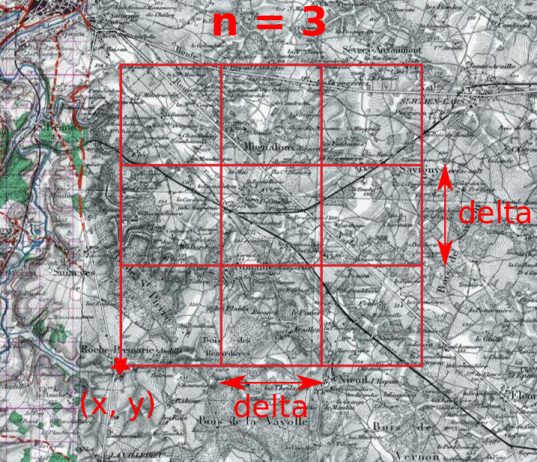

This is a small python script to generate grids of images from a WMS server.
You must modify `cfg.py` with your own parameters, they are self-explicit : 
 - url for the server
 - your selection of layers

Then launch the script with the correct parameters (as seen below)

Optionaly you could specify a wmts server and some levels of zoom if you want wmts tiles.

Please note that it's very crude, with no error checks..

## Requirements
* Python 3
* OWSLib
* pyproj

## Usage
```
$ python gen_tiles_wms.py --help
usage: gen_tiles_wms.py [-h] [-s SIZE] [-x XL93] [-y YL93] [-n NBTILES]
                        [-d DELTA] [-o OUTPUT_DIR] [--wmts]

Generate images in a grid fashion from wms server (or tiles from wmst)

optional arguments:
  -h, --help            show this help message and exit
  -s SIZE, --size SIZE  image size in pixels (default=512)
  -x XL93, --xl93 XL93  lower left x L93 (default=498465.5 )
  -y YL93, --yl93 YL93  lower left y L93 (default=6601459.5)
  -n NBTILES, --nbtiles NBTILES
                        nb of tiles per line and column (square grid,
                        default=1)
  -d DELTA, --delta DELTA
                        length of one square tile side (meters, default=3000)
  -o OUTPUT_DIR, --output_dir OUTPUT_DIR
                        output directory for images (default=.)
  --wmts                generate wmst tiles for zoom level(s) and layer in
                        config file. discard all other options except -x -y
                        and -o

```



## Example 
```
$ python gen_tiles_wms.py -x 649257.2 -y 6858461.9 -n 3 -o out 
1/9
out/scan50_1.jpg written
out/etatmajor_1.jpg written
out/cassini_1.jpg written
out/ortho_1.jpg written
2/9
out/scan50_2.jpg written
out/etatmajor_2.jpg written
out/cassini_2.jpg written
out/ortho_2.jpg written
3/9
out/scan50_3.jpg written
out/etatmajor_3.jpg written
out/cassini_3.jpg written
out/ortho_3.jpg written
4/9
out/scan50_4.jpg written
out/etatmajor_4.jpg written
out/cassini_4.jpg written
out/ortho_4.jpg written
5/9
out/scan50_5.jpg written
out/etatmajor_5.jpg written
out/cassini_5.jpg written
out/ortho_5.jpg written
6/9
out/scan50_6.jpg written
out/etatmajor_6.jpg written
out/cassini_6.jpg written
out/ortho_6.jpg written
7/9
out/scan50_7.jpg written
out/etatmajor_7.jpg written
out/cassini_7.jpg written
out/ortho_7.jpg written
8/9
out/scan50_8.jpg written
out/etatmajor_8.jpg written
out/cassini_8.jpg written
out/ortho_8.jpg written
9/9
out/scan50_9.jpg written
out/etatmajor_9.jpg written
out/cassini_9.jpg written
out/ortho_9.jpg written

```